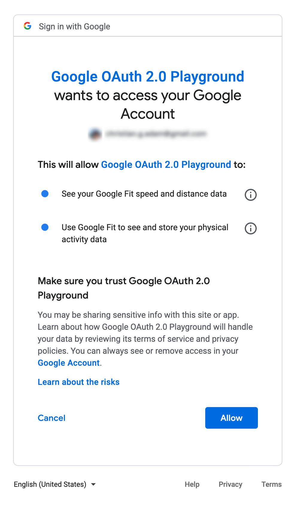

> ECMAScript is a standard, Javacript is an implementation of that standard  
\- My college WebDev proffessor

The first time those words hit my ears, I didn't understand what they meant.
After visiting the ECMAScript [website](https://262.ecma-international.org/13.0/),
I then realized, ah, the standard is just a bunch of human made requirements in textual form.
Javascript is the actual programming language that satisfies those requirements !  

Recently at work, I got the opportunity to dive deep into & learn OAuth2.0
This was the first time I got my feet wet in an [RFC](https://www.rfc-editor.org/rfc/rfc6749) and to my shock -
it was surprisingly readable.

So I thought, here I have a standard, why not implement an Authorization Server :)

# Techstack of Choice
For my techstack I've chosen to go with Spring MVC + Thymeleaf for the templating engine.
I've only seriously developed SPA websites (ReactJS) but an authorization server
just screams MPA
- We require a **server** and so an SPA would simply add a level of indirection by having
to make a call to your API backend
- OAuth2 relies heavily on HTTP Redirections (3XX) as we'll soon see, and redirecting
seems to me [hacky](https://stackoverflow.com/questions/39735496/redirect-after-a-fetch-post-call) in an SPA
- I'd like to experience how my ancestors coded

# OAuth - A primer
There's always a reason for the birth of any technology - it makes our life easier
by solving some problem. I find that unearthing the problem makes learning the
tech easier. What problem did OAuth solve ?

I never experienced this first hand, but take a look at this image  

_The password you use to log in to GMail !!_ [^1]

Giving them access to your google account just screams terror, I hope. It would be nice if you could only grant access to Yelp over let's say just your contacts and nothing else, wouldn't it ? That's precisely what OAuth enables for us.

You must be familiar with something like
{: width="50%" height="50%"}
That's OAuth in action.

## Some Terms
Before going forward, we require to understand some of the terms OAuth2 has defined. I know
you're thinking ugh, definitions, but really, terms are extremely useful for
technical communication (when not abused). It removes the ambiguity inherent in human
languages and makes us better at communicating in the problem space.[^2]
- Resource Owner - AKA The user, i.e you, the owner of your google contacts
- User Agent - The program you use to communicate with the interwebs (commonly a browser)
- Client - The program requesting access to resources on your behalf, in the above case, Yelp
- Authorization Server - The meat of this article, what we aim to implement. In the above case, [accounts.google.com](https://accounts.google.com)
- Resource Server - The server that hosts the resources. In the above case, [contacts.google.com](https://contacts.google.com)

If you'd like to learn more about OAuth and you probably should in order to follow
along, here's a lovely, plain English [YouTube video](https://www.youtube.com/watch?v=996OiexHze0).

# Let's Begin
We're going to implement [OAuth2.1](https://datatracker.ietf.org/doc/html/draft-ietf-oauth-v2-1-07)
and not [OAuth2.0](https://www.rfc-editor.org/rfc/rfc6749) for the simple reason
that since the release of RFC 6749, there have been multiple deprecations, new
RFC additions and so on. OAuth2.1 is a draft attempt to make me read a single standard
instead of, like, 5 [^3]

It might be obvious, but it does bear saying, I'm not going to and neither
and I going to be able to, implement a standards compliant OAuth
server. That takes months in addition to people power. Look at
this article more as a satisfaction of my curiosity.

## Client Registration
Prior to communicating with the Authorization Server (henceforth AS), the
client must register itself with the AS beforehand so that the AS can know who the client is when interacting with it further down the line. This may be done by registering a client secret
such as a simple username or password.

The Following details require to be provided during registration
1. Client type - Whether the client is _confidential_, i.e, able to contain
client secrets like a username and password securely or else _public_, i.e
unable to store such credentials
2. Details required by grant type - Details such as redirect URI, i.e, where
to send the user agent to after obtaining consent from the Resource Owner
henceforth referred to as RO
3. Additional fun details - like name, logo, client secrets, etc

The specification mentions two typical ways via which this registration can
be done, the first being a webpage with a form requesting such details and
the other an API endpoint. We'll go with the webpage so we can gain some 
experience with thymeleaf. 

It's important to note that the standard categorizes clients into 3 broad
types for reasons of security
1. "Web Application" - A web application here refers to a "traditional" web
app, or MPA as we might know it. This means that the RO interacts with the
client via HTML rendered by the client's webserver, displayed in the RO's user agent
(browser).
Any client credentials are stored in this webserver as it is secure, residing
privately either on premise or in the cloud, unavailable to the general
public
2. "Browser-Based Application" - The more modern type of web app or SPA as
we might know it. Such an application is rendered directly within the browser
after pulling the initial HTML+CSS+JS code bundle from a CDN. Due to the way
browsers work, we can simply inspect this bundle and see any client secrets
stored within such code or local storage. Thus it is insecure as its available
to the general public or exposed via scripting attacks. If we wish to 
store a client secret here, we should utilise the BFF pattern (Backend For Frontend) or register the client dynamically at runtime(probably not going
to be covered in my nonstandard standard implementation). Most SPAs have
a backend in the form of a REST API, so that should suffice for BFF
3. "Native Application" - Apps that run natively on a desktop, or mobile.
These apps are also considered insecure due to the fact that the executable
can in theory be decompiled and any such secrets extracted. Use the same solution as (2) if requiring to store client secrets

## Finally, code
We'll follow a pretty basic Spring + Thymeleaf project layout, something like
```text
src/main/java/auth_server
├── AuthServerApplication.java -- Main springboot application class
├── Controller.java -- Main controller class
├── exception
│   ├── AnyAndAllExceptionsHere
├── GlobalControllerExceptionHandler.java -- @ControllerAdvice class
├── model
│   ├── AnyAndAllModelClassesHere
└── service
    └── AnyAndAllServiceClassesHere
```

To start off, we create a WebMVC controller endpoint at `/register`
```java
@GetMapping("/register")
@CrossOrigin
String register() {
  return "registration.html";
}
```
Returning a string here involves some Spring magic - ViewResolver.
Any string returned from a controller is passed into this ViewResolver
which then searches for a template by the same name that's commonly
stored in the `$CLASSPATH/resources/templates` directory.

Just so turns out we have a file named `registration.html` in there.
```html
<form action="/register" method="post">
    <div>
        <label for="name">Name</label>
        <input id="name" name="name" type="text"/>
    </div>
    <div>
        <label for="client_type">Client Type</label>
        <select id="client_type" name="clientType">
            <option>Confidential</option>
            <option>Public</option>
        </select>
    </div>
    <div>
        <label for="redirect_uri">Redirect URI</label>
        <input id="redirect_uri" name="redirectUri" type="url">
    </div>
    <input type="submit"/>
</form>
```
Here we display a simple form requesting for the name, client type
and redirect URI as was discussed earlier.

The form posts to `/register` and this time we hit a controller with
the same endpoint but a different HTTP action (POST)
```java
@PostMapping("/register")
@CrossOrigin
String handleRegistration(@RequestParam Map<String, String> clientDetails) throws Exception {
    registrationService.registerClient(clientDetails);
    return "redirect:success";
}
```
Calling the `registrationService` essentially extracts out the form fields, creates
a client (POJO) with those properties and adds it to a list of clients.
And that's it for our registration endpoint ! Woohoo !

## The Meat of OAuth
In a nutshell, the auth flow looks something like
1. The client redirects the RO to the authorization endpoint
2. The AS authenticates the RO
3. The AS presents the RO with a consent page
4. The AS then represents the consent as an Authorization Grant[^4] 
which is sent back to the client redirect URI

Thus, an OAuth server generally[^5] utilises 3 endpoints
1. `/authorize` - For authenticating and gaining permission(s) from the RO
2. `/token` - For receiving a token in exchange for an auth code grant,
more on that later
3. `Redirection URI` - as discussed earlier, the client's endpoint to
which the AS sends the token

## ENDPOINT - Authorization
The spec defines 3 authorization grant types
1. Authorization Code
2. Client Credentials
3. Refresh Token

But phew, we've covered quite a bit already. We'll begin with Authorization
Code Grant in the next part, that will be listed here.

Bye for now.


---
#### Footnotes
{: data-content="footnotes"}

[^1]: [A brilliant article ranting about the problem before a solution existed](https://blog.codinghorror.com/please-give-us-your-email-password/)
[^2]: [One of my favorite papers sheds some light on the benefits of unambiguity](https://www.cell.com/fulltext/S1535-6108(02)00133-2)
[^3]: [It's Time for OAuth 2.1](https://aaronparecki.com/2019/12/12/21/its-time-for-oauth-2-dot-1)
[^4]: In the current OAuth2.0 standard, there's actually also support for an 'implicit grant' flow that skips the generation of this Authorization grant and instead just sends back a token. But this is pretty insecure and a few years down the line will be unsupported
[^5]: The reason I say generally is because the spec provides for extensibility, i.e, extensions can be specified down the line that requires the use of additional endpoints
