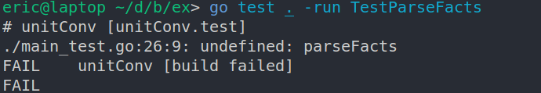
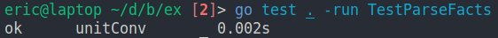

# Unit Tests FTW
Unit tests are gospel. They ensure the code you've written is correct,
lends confidence during refactoring, promotes loose coupling, etc. Clean code necessitates it.
I know it. You know it. But no one wants to do it.  
I've let in a few gophers into my backyard lately and while interacting with them, I came across an interesting [video on building legacy systems](https://www.youtube.com/watch?v=Kwtit8ZEK7U).
It's humurous, indepth and informative - highly recommend watching that. From the video I came across his
[unit testing tutorial](https://quii.gitbook.io/learn-go-with-tests/) that aligned with both my professional
work requirements (sonar: unit test your code!!) as well as personal curiosities (learn Go).

But I wasn't really sold until I was tasked with refactoring a service at work. Here I had some code that needed
a fair bit of effort to refactor, but this was code someone else wrote. How could I be certain that I didn't mess something up?
Obviously, manually run the code before and after the refactoring. Oh and also inbetween. Oh and compare that with the original output
and so on and so forth. Due to the immense pain that followed, the requirement for unit testing finally clicked. If I had unit
tests, all I would have to do is hit `ctrl <;>, ctrl <l>` (my binding for running tests) and I'm done.

But but but I had tried it in the past and unit tests were scary. Spies, mocks, stubs, scary annotations like `@ExtendWith{MockitoExtension.class}`,
what the hell is all that?[^1]. I think this is where Go shines, with its simplicity[^2]. Additionally, Go as a language has first class support
for testing by having it built into the [standard library](https://pkg.go.dev/testing). We'll see more on the absolute simplicity of Go later.

Today after spending a few weeks on learning how to unit test effectively, I experienced a technical breakthrough. I came across a
[Jane Street Mock Interview](https://youtu.be/V8DGdPkBBxg) where the task was to build a unit converter. Given the following facts and queries:

Let's think about this a little. We have as input a list of facts with each representing a conversion between units. However, as seen in the above
query, a direct conversion fact between two units need not be provided, rather we have to "follow the relationship" from one pair of
units to the other. So in this case we have `1 meter -> (1*3.28)=3.28 ft -> (3.28*12)=39.36 inches`. Looks like everytime we follow a link, we
multiply the preceeding conversion value by the current one. How do we model this relationship in code?  
If you've spent some time practising DSA, relationships generally suggest a graph - think of your social network, with friends as vertices
and edges as the relationship. In a similar manner, we can model the units as vertices and the edge as a possible conversion between them.
Vertices with no direct or indirect relationships between them will be considered not convertible.

A graph it is, then. We've agreed on an <i>abstract</i> data type however what's the concrete data structure we'd use?
There are a few options
1. Adjacency list
2. Adjacency matrix
3. Linked list, etc

Each one of these have their pros and cons with regards to the type of graph, sparse or not, but we won't go into that - let's settle on an
easy to use [adjacency matrix](https://en.wikipedia.org/wiki/Adjacency_matrix)! When there exists an edge between two units, the value of that
edge would be the conversion multiplier, depending on the starting unit. The opposite edge would have the reciprocal multiplier!

_todo(): image of matrix_

Great, we've settled on the 'DS' of DSA. Coming to the algorithm, as I explained earlier, it looks like we chain multiply the
conversion value until we reach the destination unit. There are 2 main methods of traversing a graph, breadth first search (BFS) and
depth first search (DFS). Once again, both have their pros and cons that we won't go into - let's settle on DFS since it's easier to traverse
with just a recursive function.

And so we've completed the DSA brainstorming. Now comes the implementation. Eeeeeeeeeeeeeeeek screams my mind. It jumps to a million places.
How will I find out the multiplier? How will I prevent infinite traversal? How do I parse the facts? Convert it into a graph? And on and on
and on, with each imaginary implementation my mind raises another 50 questions. At this point I'd begin a frenzied hacking eventually involving
trial and error to the point where I'd give up and cave in to fast-forwarding to the solution.

But here's where unit testing came to my rescue. Rather than thinking light years ahead, over-engineering and ending up overwhelmed, I
focused on writing a unit test for the tiniest bit of functional code I could think of - parsing facts. Eventually
when we create the adjacency matrix, we require to know the number of vertices. If we parse each fact in isolation, we would end up with
duplicate vertices. So I'm thinking we'll parse the array and extract out a set of units. Sure, this is probably wrong and I'm probably
missing something but that's okay, when I have unit tests I can later on refactor to my hearts content.  
With Test Driven Development, you
1. Write a test
2. Run it and expect failure
3. Write the least amount of code to make it pass
4. Refactor
5. Repeat until satisfied

I'm choosing to go with Go so let's write up a little test for `parseFacts`  

Here we have a test function that takes in a variable t provided by the `go test` tool. It's essentially a type that provides utility functions
such as printing error messages, running seperate tests, etc. Next we have a slice of `Fact`s - don't worry that we haven't declared it yet,
all we're focused on is writing a test to specify what we want. We then call our parsing function with that slice - once again, don't worry about
writing it, simply call it as you'd imagine it would be. Our expected output is specified in `want`, a slice of strings representing each
vertex (with no duplicates!). Finally, we call `reflect.DeepEqual` to check whether reality meets our expectation and if not, print
an error message notifying the deviation.

Fail the test

Now, let's write the _least_ amount of code to make the test pass.

We have a struct with `u1` for the first "from" unit, `u2` for the "to" unit and `cValue` for the multiplier.
Remember, we're not bothered about clean, beautiful, efficient 10x code right now. We just need the bare minimum to pass the test.

_And so it does!_

Now that we have a passing test, we can refactor with complete confidence that we won't break the functionality!
It seems like what we really want to do is check whether the units slice contains the current unit or not.
Go, in the spirit of its philosophy, doesn't do much for you. You'll have to roll your own `sliceContains` function to do
that[^3]. Test first!

Run it, fail it, and write the minimum amount of code to pass it.

_Run the test and watch it pass._  

I'm pretty happy with the function I've written, so I'll skip the refactoring step.

Let's use our new function to simplify our `parseFact` code.

The function loops through the fact slice and checks whether the first and second unit exist within the slice and
if not, adds it to the unit slice.
Thanks to our unit test, theres no need of manually testing to check whether you've broken the function, simply run `go test . -run TestParseFacts` and you're done!

Next, we require to create our graph. In order to build the adjacency matrix, we require the number of vertices to build the matrix (every vertex could in theory
be related to each other).

My old self shouts at me. "You should already get back a graph populated with conversion values as the edges. What are you, stupid?".  
But my new unit testing persona steps in and says "Hey, don't overwhelm yourself. Also, single responsibility principle! That'll
lead to better testable code too. Make another function when you're done
with this which populates the graph :)". I like the new persona. It's kind. It's doable.

Woohoo! Another step closer. Next up, population. Our graph will be a directed one - it matters which unit you're converting from and to. One direction
will have the conversion value as its edge, while the other will have its reciprocal. At first, this scares me a little - how do I specify a direction?
But my persona tells me to trust in TDD and trust I shall.

_Given a bunch of facts, I want a graph that looks like so. Let me get that graph from an imaginary populateGraph. Woohoo! I love unit tests._

As I began to attempt writing out the minimum viable code, I realised that I'm identifying vertices by number (matrix indexes), not by the unit name. I'll
need some way of _mapping_ between the two. I know, I'll use a `map[string]int`! Hmm, but currently my parser returns a slice of strings. I'm going to need a map now.
Time to refactor! First, tell the unit testing Genie what you wish for.

Genie, unfortunately, != ChatGippity

Lucky for us, we can confirm that nothing broke simply by running the unit test :-)

Back to business! Now that we've got our mapping, let's re-attempt `populateGraph`

_Run the test and feel at ease._

At this point, not gonna lie, I patted myself pretty hard on the back. I normally never achieve such clean, concise and reusable code so early into the
development process. Look how neatly you composed your functions, obeying the single responsibility principle while at the same time ensuring your
code is testable and maintainable 30 years down the line!  

We've now completed the DS of DSA. As mentioned earlier, our algorithm of choice is DFS. However, writing a test and implementing this in isolation seems
a bit abstract for me. How am I going to use the algorithm and integrate it with my unit converter? I feel I should concretize my business requirement a
little more before going further.
Let's write an acceptance test. You can consider this a "high level" unit test that might be broken down into smaller tests later in order to satisfy the
original test. The reason I'm reaching for an acceptance test is that it's closer to the user's requirement, which is what I need to achieve.

We've now got a number of test cases, with each one having either an expected value or an error as the result. Based on that, we'll either check whether the floats are
(approximately) equal or whether an error was thrown.

As I began to type out my `convert` function, I realised I would need my chain of multiplications, as mentioned earlier. Forget thinking about implementation. Let's comment out
the acceptance test and write a unit test for `findPathMultiplier` that would yield this conversion value.

Here we find the chain multiplier from vertex 0 to vertex 2, given a graph and a structure to maintain visited nodes so we don't infinitely recurse.
A simple and small step toward a complicated requirement!

Let's attempt to write it out.

_Passed!_

And now, the final step, implementing `convert`. It scares me as I wonder how I would integrate the DFS algorithm into our converter. But we've got our tests, let's just
write the minimum viable code without worrying about it too much. Uncomment the acceptance test and let's begin.

Wow. That's what, 4 lines? Clear, concise and easy to follow. We create a graph to remember which vertices we've visited, extract the 'from', 'to' vertex index
and pass that into our previously developed and tested function. That returns the multiplier, to which we multiply our query value and thats that!

It comes to my mind now that perhaps what I was lacking was not unit tests but rather a systematic approach to decompose and solve a complex problem. That may as well be true, but
that is also another reason to unit test - it forces you to think small and iteratively.

With that, we come to an end. Without striving for it, we managed an 88.1% test coverage! We didn't force a test
anywhere nor did we refactor implementation to allow for unit tests. Thats the power of TDD.  
Hope I've convinced you to give it a Go! (pun intended)

---
#### Footnotes
{: data-content="footnotes"}
[^1]: Turns out this is a common gripe with the Java ecosystem (or perhaps mainly with Spring) - a high level of magic exists that makes things difficult to comprehend and reason about.
[^2]: [Reddit agrees](https://www.reddit.com/r/golang/comments/11p9g1r/go_doesnt_do_any_magical_stuff_and_i_love_that/)
[^3]: [Reddit is pissed](https://www.reddit.com/r/programmingcirclejerk/comments/13o6u9c/fuck_you_go/)
